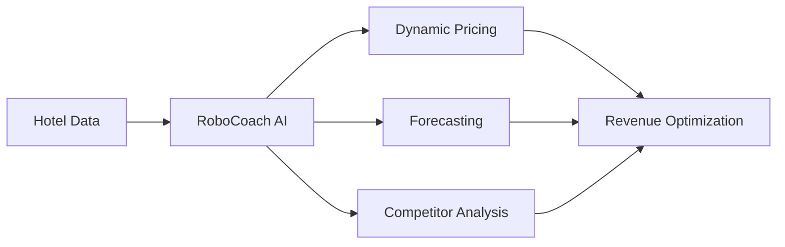

<h1 align="center">
  
</h1>

  <strong>AI-Powered Revenue Management System for Hotels & Hospitality</strong> 
  Maximize occupancy. Optimize revenue. Outsmart competitors — all in one platform.

  

---

## ✨ Overview

**Pricing Coach** is an intelligent, AI-driven Revenue Management System (RMS) tailored for the hospitality industry. From boutique hotels to multi-property groups, it empowers your team to:

- Set competitive prices with real-time data
- Forecast occupancy and revenue accurately
- Automate pricing decisions
- Track competitor strategies
- Analyze guest sentiment

> “Maximize your revenue with the AI‑based RMS built for hospitality.” — [pricing-coach.com](https://www.pricing-coach.com)

---

## Key Features

| 🚀 Feature | Description |
|-----------|----------------|
| 🤖 **RoboCoach AI Assistant** | Get real-time recommendations from your virtual revenue strategist. |
| 📉 **Dynamic Pricing Engine** | Automatically adjust prices based on market demand, seasonality, and competition. |
| 📊 **Forecasting Module** | Predict occupancy, revenue, and performance using historical + real-time data. |
| 🕵️‍♀️ **Competitor Rate Shopper** | Track your rivals' pricing and adjust instantly. |
| 💬 **Reputation Insights** | Analyze guest reviews and align prices with perceived value. |
| 🔔 **Alert System** | Stay informed about critical changes in occupancy, pricing, and competitor activity. |

---

## Who Is It For?

- 🏙️ City Hotels  
- 🏡 Boutique & Lifestyle Hotels  
- 🌴 Resorts & Holiday Villas  
- 🏢 Hotel Chains & Groups  
- 👥 Revenue Managers & GMs

---

## How It Works

1. **Connect Your Data**  
   Integrate historical bookings, demand patterns, and other data sources.
2. **Activate Modules**  
   Enable RoboCoach, Dynamic Pricing, and Rate Shopper to start receiving insights.
3. **Optimize in Real-Time**  
   Adjust prices, react to changes, and test pricing strategies.
4. **Track Results**  
   Monitor the impact on occupancy, ADR, and overall revenue.

## 

- **Website**: [pricing-coach.com](https://pricing-coach.com)
- **Email**: [info@pricing-coach.com](mailto:info@pricing-coach.com)
- **Linkedin**: [pricingcoach](https://tr.linkedin.com/company/pricingcoach)
- **Instagram**: [pricing_coach](https://www.instagram.com/pricing_coach/)
